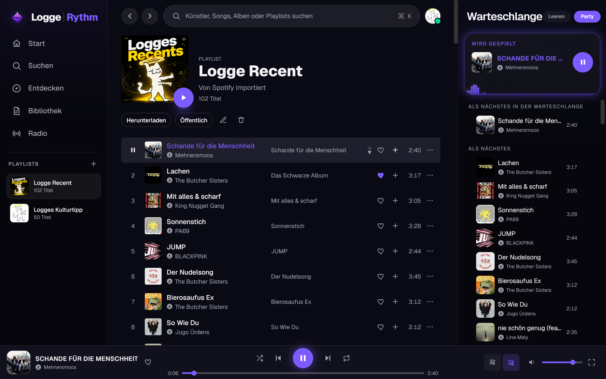
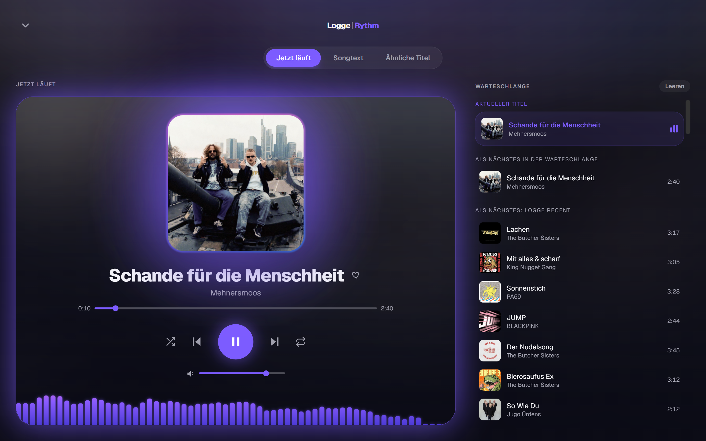
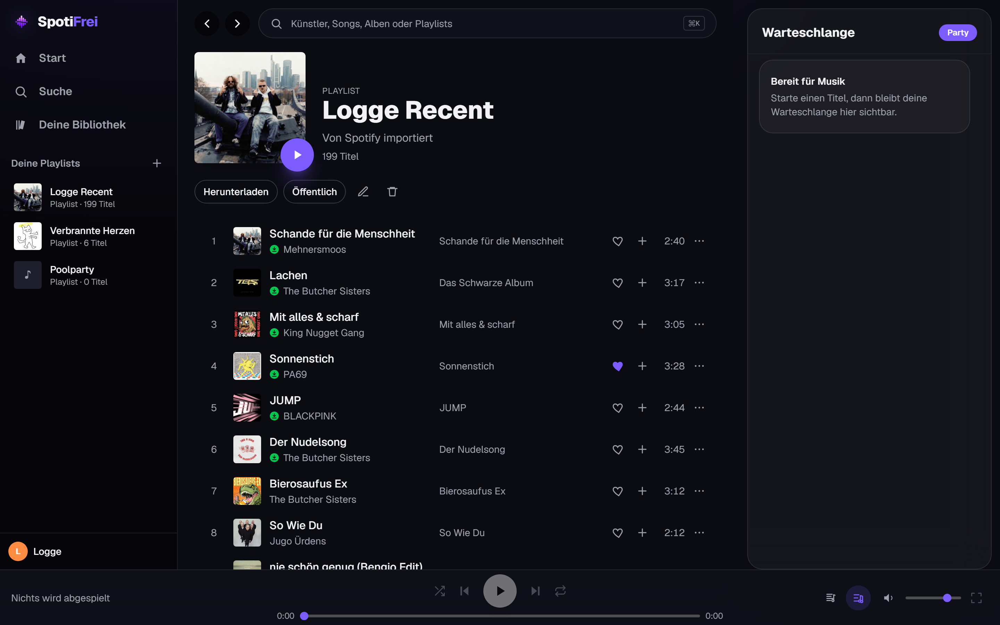

# LoggeRythm

LoggeRythm is a self-hosted, private Spotify-style music app. It pairs a FastAPI backend with a Next.js frontend to deliver full-track playback, browsing, search, playlists, and social features in a polished web player. Audio is sourced from Deezer using an account ARL cookie and decrypted server-side, so it streams complete tracks rather than 30-second previews. **This is an explicitly private / demo project that lives in a legal grey area — it is not intended for public distribution or commercial use.**

## Screenshots

| Two-level queue | Fullscreen player | Offline markers |
|---|---|---|
| [](docs/screenshots/01-queue.png) | [](docs/screenshots/02-now-playing.png) | [](docs/screenshots/03-downloads.png) |

## Architecture

- **`api/` — FastAPI backend**
  - SQLAlchemy ORM (SQLite by default; any `DATABASE_URL` SQLAlchemy supports).
  - JWT auth stored in an HTTP-only session cookie.
  - Deezer adapter that establishes a session from the ARL, fetches encrypted streams, and decrypts them server-side; downloaded tracks are cached to disk with a retention window.
  - Background daemon that evicts stale cached tracks.
- **`web/` — Next.js 16 frontend**
  - App Router, TypeScript, Tailwind CSS v4.
  - Zustand for client state (the player), TanStack Query for server state.
  - Dev server proxies `/api/*` to the backend at `http://127.0.0.1:8000` (see `web/next.config.ts`), so the browser only ever talks to the Next.js origin.
- **`mobile/` — native Android app**
  - React Native/Expo frontend with native Track Player playback.
  - Android MediaSession, background playback, notification controls, and Android Auto integration.
  - This is the repository's only Android application; the former Capacitor WebView wrapper has been removed.
  - `.github/workflows/mobile-android.yml` (`Native Android QA`) is the sole Android build and validation workflow.

## Features

- **Auth** — email/password registration and login with JWT cookie sessions. New accounts require admin approval, or can be auto-approved via single-use invite links.
- **Browse & search** — search and browse tracks, albums, artists, playlists, and genres.
- **Full playback** — complete-track streaming, shuffle and repeat, crossfade, a circular audio visualizer, OS-level media controls via the MediaSession API, the current song reflected in the browser tab title, and synced (time-stamped) lyrics from [lrclib.net](https://lrclib.net).
- **Two-level queue** — manually queued songs ("add to queue" / "play next") form a primary queue that always plays before the secondary queue fed by the current playlist/album or song radio, Spotify-style.
- **Playlists** — full CRUD, custom covers, and public/private visibility.
- **Likes** — like/unlike tracks.
- **Follows** — follow other users.
- **Spotify-link import** — paste a Spotify track/album/playlist link; metadata is resolved via the Spotify API and matched to Deezer for playback.
- **Song radio** — endless similar-track radio seeded from a song, using Last.fm similarity (falls back to Deezer's own artist mix when no Last.fm key is set).
- **Offline downloads** — cache a playlist's tracks into the browser (Cache Storage + service worker) for offline playback; downloaded songs show a per-track marker in every track list.
- **Party mode** — collaborative, shared listening queue accessed by a party code.
- **Personal stats** — listening statistics per user.
- **Profiles & avatars** — public user profiles with uploadable avatars.
- **Storage management** — cached tracks are kept on disk with a configurable retention window (default 30 days) and automatically evicted.
- **Admin** — user listing, approval, and deletion; storage inspection and manual cleanup; invite-code creation and listing.

## Setup & Run

### Backend (`api/`)

```bash
cd api
python -m venv .venv
.\.venv\Scripts\pip install -r requirements.txt
copy .env.example .env        # then edit .env and fill in values
.\.venv\Scripts\python -m uvicorn app.main:app --port 8000
```

The API runs on `http://localhost:8000`. On first startup it creates the SQLite database, runs lightweight migrations, and initializes the Deezer session.

### Frontend (`web/`)

```bash
cd web
npm install
npm run dev
```

Open <http://localhost:3000>.

## Environment Variables

Configured in `api/.env` (copied from `api/.env.example`). Defaults come from `api/app/config.py`.

| Variable | Required | Default | Description |
|---|---|---|---|
| `DEEZER_ARL` | **Yes** | — | Deezer account ARL cookie used to authenticate streams. **Secret — never commit it.** |
| `DEEZER_QUALITY` | No | `mp3` | Preferred audio quality / format for fetched streams. |
| `STORAGE_DIR` | No | `storage` | Directory where decrypted track files are cached. |
| `STORAGE_RETENTION_DAYS` | No | `30` | Days a cached track may go unplayed before eviction (`0` = keep forever). |
| `DATABASE_URL` | No | `sqlite:///./spotifrei.db` | SQLAlchemy database URL. |
| `JWT_SECRET` | Recommended | `dev-secret-change-me-in-production` | Secret used to sign session JWTs. **Change in production.** |
| `COOKIE_SECURE` | No | `false` | Set `true` to mark the session cookie secure (HTTPS only). |
| `COOKIE_SAMESITE` | No | `lax` | SameSite policy for the session cookie. |
| `SPOTIFY_CLIENT_ID` | No | — | Spotify app client ID; enables Spotify-link import. |
| `SPOTIFY_CLIENT_SECRET` | No | — | Spotify app client secret (paired with the client ID). |
| `SPOTIFY_RESOLVE_LIMIT` | No | `200` | Max tracks resolved from a single Spotify album/playlist. |
| `LASTFM_API_KEY` | No | — | Last.fm API key for song-radio similarity; without it the radio uses Deezer's mix. |

Spotify import is disabled unless both `SPOTIFY_CLIENT_ID` and `SPOTIFY_CLIENT_SECRET` are set. Last.fm radio similarity is optional.

## First Run

The **first user to register becomes the admin** and is automatically approved. Every subsequent user is created unapproved and must either be approved by an admin or register with a valid single-use invite link (generated from the admin tools). If the database already contains users but no admin, the lowest-ID user is promoted to admin on startup.

## Legal / Disclaimer

LoggeRythm is for **private, personal use only**. It streams audio via Deezer in a way that sits in a legal grey area with respect to Deezer's Terms of Service. Do not distribute it publicly, host it as a service, or use it commercially. You are responsible for ensuring your use complies with all applicable laws and the terms of any third-party services involved.
